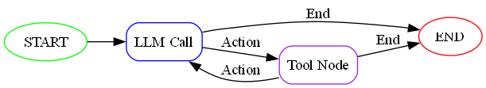

# AI Agent Demo

## Overview

This example will demoenstrate how to utilize Lang-graph libraries to make an AI agent that can understand prompts and invoke the approprate function based on a set of defined function from a `csv` file.
In this demo we will showcase few service:

| service_name | service_url | service_payload | description |
|-------------|-------------|-----------------|-------------|
| hospital_service | <https://webhook.site/1851d097-5ae6-4fd3-8e19-b17f358b4471> | {"patient_id":"p123","emergency_type":"medical","severity":"critical"} | For medical emergencies, pregnancies, injuries, health issues |
| sos_service | <https://webhook.site/1851d097-5ae6-4fd3-8e19-b17f358b4471> | {"emergency_type":"general","location":"city_center","priority":"urgent"} | Only for general emergencies when unsure which specific service to call |
| travel_service | <https://webhook.site/1851d097-5ae6-4fd3-8e19-b17f358b4471> | {"destination":"paris","dates":{"departure":"2024-04-01","return":"2024-04-07"},"travelers":2,"preferences":{"class":"economy","accommodation":"hotel"}} | For booking flights, hotels, and travel packages |
| restaurant_service | <https://webhook.site/1851d097-5ae6-4fd3-8e19-b17f358b4471> | {"restaurant_id":"rest123","order_type":"delivery","items":["pizza","salad"],"special_instructions":"no onions"} | For restaurant orders, reservations, and food delivery services |
| spa_service | <https://webhook.site/1851d097-5ae6-4fd3-8e19-b17f358b4471> | {"service_type":"massage","duration":"60min","therapist_preference":"any","special_requests":"deep tissue"} | For spa appointments, wellness treatments, and relaxation services |

---

### Install dependencies and run the virtual environment shell

```sh
poetry install
poetry shell
```

### Get Free API keys from Groq

visit thise website: <https://console.groq.com/keys> and generate new `apikey`

### Install Graphviz System Software For Visualizing the Graph

you can install from their website: <https://graphviz.org/download/>

or if you are windows user just run this command as admin `choco install graphviz`




### Run Streamlit for GUI Chat With AI Agent

```sh
streamlit run src/app.py # or poetry run start
```
